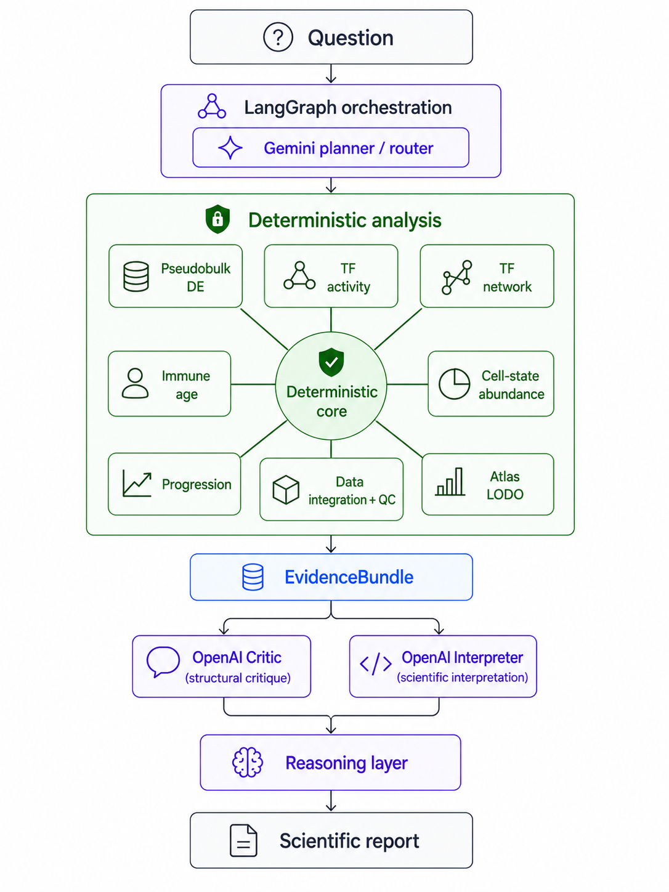
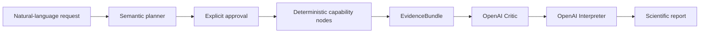

# CellState Agent


<!-- live-demo -->
<h2 align="center">
  <a href="https://jriv724.github.io/cellstate-agent-portfolio/">
    Launch the CellState Agent Science Demo →
  </a>
</h2>

<p align="center">
  <a href="https://jriv724.github.io/cellstate-agent-portfolio/">
    
  </a>
</p>

> Explore the live workflow, capability map, scientific results, figures, videos, and public scientific report.
<!-- /live-demo -->


CellState Agent is a research prototype for turning natural-language computational-biology questions into auditable, approval-gated scientific analyses.

## Public Evidence Bundle

A complete, auditable example analysis is available for **GZMB CD8 T cells in NBM versus NDMM**.

- [Evidence bundle overview](demo_evidence/gzmb_cd8_nbm_vs_ndmm/README.md)
- [Final scientific report](demo_evidence/gzmb_cd8_nbm_vs_ndmm/reports/scientific_report.pdf)
- [Structured scientific report](demo_evidence/gzmb_cd8_nbm_vs_ndmm/reports/scientific_report.json)
- [Critic report](demo_evidence/gzmb_cd8_nbm_vs_ndmm/reports/critic_report.json)
- [Interpretation report](demo_evidence/gzmb_cd8_nbm_vs_ndmm/reports/interpretation_report.json)

The bundle includes patient-level pseudobulk differential expression, design and estimability checks, leave-one-dataset-out robustness analysis, cross-resource transcription-factor activity inference, figures, provenance records, manifests, and SHA-256 checksums.

The workflow separates deterministic statistical analysis from LLM-based scientific critique and interpretation. Evidence integration consumes structured results and structured critiques rather than unrestricted narrative output.


## Auditable workflow

LangGraph coordinates planning, approval, execution, evidence review, and reporting. Scientific calculations remain in deterministic capability nodes: the language-model agents can critique evidence and explain results, but they cannot alter computed values.



Implemented capabilities include:

- Independent-replicate pseudobulk differential expression with DESeq2
- Confounding and design assessment
- Exploratory leave-one-dataset-out robustness analysis
- Signed transcription-factor activity using DoRothEA and CollecTRI
- Structured evidence validation with provenance-bearing `EvidenceBundle` objects
- Separate Critic and Interpreter agents
- JSON, PDF, PNG, and SVG reporting

## Quick start

Use a Python 3.10+ environment and provide your own input data and regulatory resources through generic paths:

```bash
python -m pip install -e .
cp config/resources.env.example .env

export CELLSTATE_ATLAS_PATH=/path/to/atlas.h5ad
export CELLSTATE_DOROTHEA_PATH=/path/to/dorothea.tsv
export CELLSTATE_COLLECTRI_PATH=/path/to/collectri.tsv
read -rsp "OpenAI API key: " OPENAI_API_KEY && echo
export OPENAI_API_KEY
export CELLSTATE_ENV_FILE=.env

./run-cellstate-agent.sh
```

R, DESeq2, and Matrix are required for DESeq2-backed analyses. See the [public technical overview](docs/public/README.md) and [TF resource instructions](resources/tf_activity/README.md) for details.

## Demo

Workflow, results, and capability videos will be linked after local asset review. Binary demo assets are not distributed in this repository.

## Evidence and safety boundaries

- No patient data are included; public tests use only synthetic fixtures.
- Downloaded regulatory resources are excluded and must be supplied by users.
- LLM components cannot alter deterministic scientific results.
- Generated interpretations and hypotheses are not causal evidence.
- This repository is a research prototype, not a clinical or causal-inference system.

For publication boundaries, see the [export manifest](PUBLIC_EXPORT_MANIFEST.md), [asset policy](docs/public/ASSET_POLICY.md), and [licensing checklist](docs/public/LICENSING_CHECKLIST.md).
